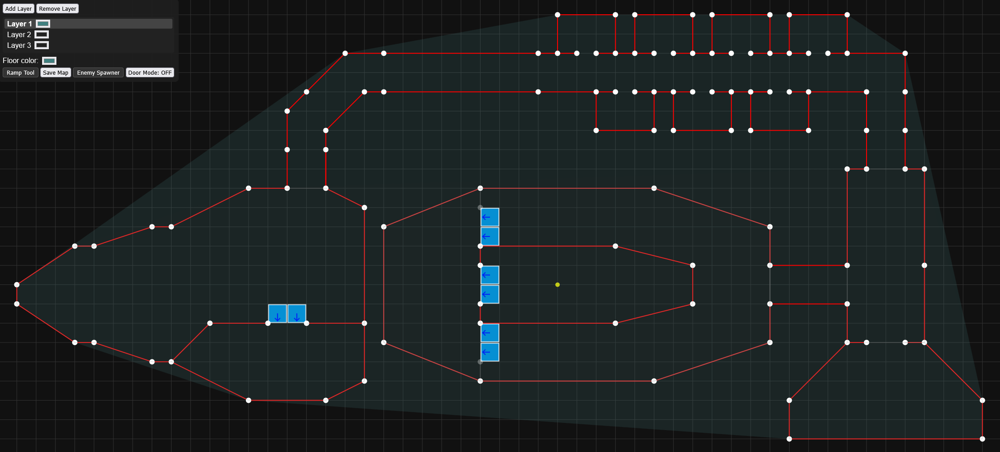
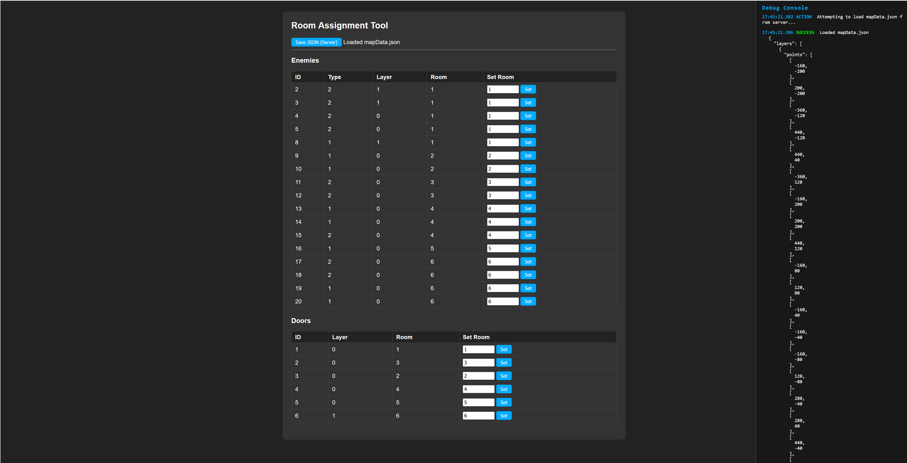

# DoomStyle

MIT License

## Purpose

**DoomStyle** is a multi-layer 2.5D map editor and renderer inspired by classic Doom-style games. It allows you to create, edit, and visualize multi-layered maps with features such as walls, floors, ramps, doors, enemies. Then you can play the map yourself and try to survive until the end.

The main features include:

- Multi-layer map editing with a 2D editor and 3D Babylon.js renderer
- Polygonal floor generation (with support for holes)
- Wall, ramp, and door placement
- Enemy spawner tool
- Undo/redo and map saving/loading
- Export to JSON for use in your own game engine or renderer
- Project statistics script for README
- Gameplay with enemy killing to unlock new rooms

## Development Team

- **SnapBanane** - ~45 hours
- **GamekniteC7** - ~35 hours  
- **PlutoEdiMedi** - ~20 hours

**Total development time: ~100 hours**

## Disclaimer

This project is for educational and non-commercial use.  
Do not use any part of this project for malicious purposes.

## Preview




## Installation

Clone the repository:

```sh
git clone https://github.com/snapbanane/doomstyle.git
cd doomstyle
```

Open `map/mapConstructor.html` in your browser to use the map editor.

Open the Webserver via `node server` (requires node.js to work) and play the map yourself

## Usage

- Use the 2D editor to add points, walls, ramps, doors, enemies, and holes.
- Save your map to JSON for use in your game or renderer.
- Use the included PowerShell script (`stats.ps1`) to generate project statistics for your README.

On Windows run:

```sh
.\boot.ps1
```

On Linux use:`

```sh
chmod +x boot.sh # for permissions
./boot.sh
```

## Project Statistics

You can generate up-to-date stats with: (only works on windows though)

```powershell
.\stats.ps1
```

## Contributions

Pull requests are welcome!  
If you have a feature idea or bugfix, please open an issue or PR.  
For larger changes, please discuss with the maintainer first.

---

**MIT License**  
See [LICENSE](LICENSE)
